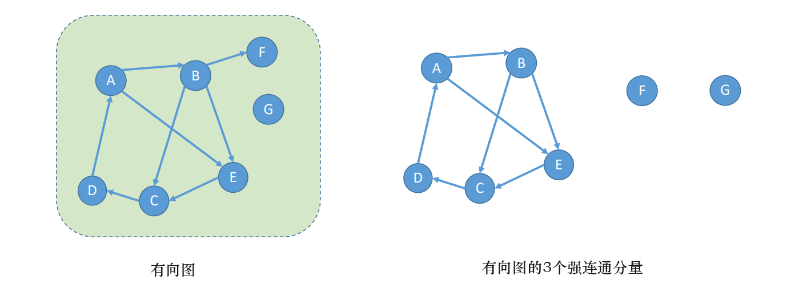
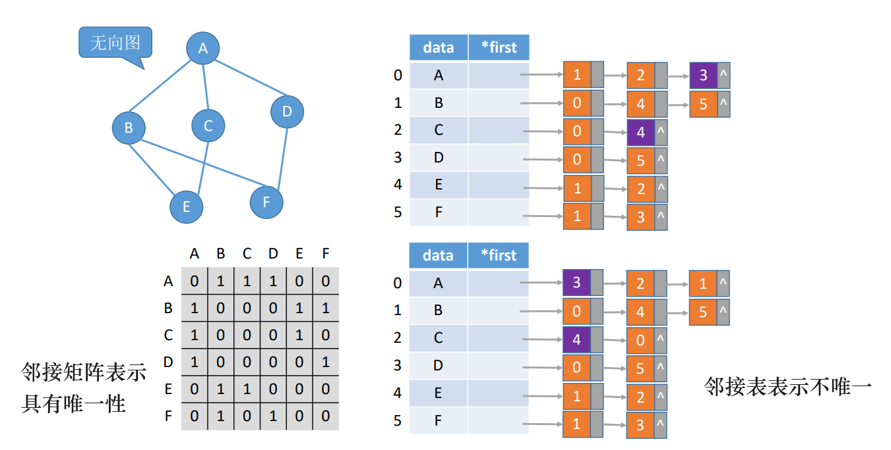

#数据结构 #C 

# [63] 图的基本概念
## 1.定义 


图 $G$ （Graph）由顶点集 $V$ （Vertex）和边集 $E$ （Edge）组成，记为： 
$$G = (V, E)$$
其中 $V(G)$ 表示图 $G$ 中顶点的有限非空集； $E(G)$  表示图`G`中顶点之间的关系（边）集合。  
若： 
$$V = \{v_1, v_2, … , v_n\}$$
则用 $|V|$ 表示图 $G$ 中顶点的个数，也称图 $G$ 的阶（Order）。
同时：
$$E = \{(u, v) | u \in V, v\in V\}$$
用 $|E|$ 表示图 $G$ 中边的条数。

> 线性表可以是空表，树可以是空树，但图不可以是空，即V一定是非空集。

## 2.图的应用
物理世界中，国家铁路网络就是一张图，各个车站就是**顶点集**，铁路线即为**边集**。


网络世界中，微信好友、微博好友就是一张图，各个个人用户属于**顶点集**，用户与用户之间的关系属于**边集**。不同的是，微信好友是必须双向的，而微博好友是允许有单向的（关注和被关注独立）。


## 3.无向图和有向图


### 无向图 
若 $E$ 是**无向边**（简称边）的有限集合时，则图 $G$ 为无向图。  
边是顶点的无序对，记为：
$$(v, w) $$ 
或
$$(w, v)$$     
因为 $(v, w)$ = $(w, v)$ ，  
其中 $v$ 、 $w$ 是顶点。可以说顶点 $w$ 和顶点 $v$ 互为邻接点。  
边 $(v, w)$ 依附于顶点 $w$ 和 $v$ ，或者说边 $(v, w)$ 和顶点 $v$ 、 $w$ 相关联。 

图中可以表示：
$$G_2 = (V_2, E_2) $$
$$V_2 = \{A, B, C, D, E \} $$
$$E_2 = \{(A, B), (B, D), (B, E), (C, D), (C, E), (D, E) \}$$

### 有向图 
若 $E$ 是**有向边**（也称弧）的有限集合时，则图 $G$ 为有向图。 
弧是顶点的有序对，记为： 
$$\left \langle v,w \right \rangle$$
其中 $v$ 、 $w$ 是顶点， $v$ 称为**弧尾**， $w$ 称为**弧头**  
$\left \langle v,w \right \rangle$ 称为从顶点 $v$ 到顶点 $w$ 的弧，也称 $v$ 邻接到 $w$ ，或 $w$ 邻接自 $v$ 。  
注意：
$$\left \langle v,w\right \rangle ≠ \left \langle w,v\right \rangle$$

图中可以表示：
$$G1 = (V_1, E_1) $$
$$V2 = \{A, B, C, D, E\} $$
$$E2 = \{\left \langle A, B \right \rangle, \left \langle A, C \right \rangle, \left \langle A, D \right \rangle, \left \langle A, E \right \rangle, \left \langle B, A \right \rangle, \left \langle B, C \right \rangle, \left \langle B, E \right \rangle, \left \langle C, D \right \rangle\}$$

## 4.简单图、多重图
简单图：不存在重复边，不存在顶点到自身的边。  
多重图：图中某两个结点之间的边数多于 一条，又允许顶点通过同一条边和自己关联， 则为多重图。  
不做特殊说明，本部分内容的图均指**简单图**。


## 5.顶点的度
对于无向图，  
顶点 $v$ 的度是指依附于该顶点的边的条数，记为 $TD(v)$ 。 在具有 $n$ 个顶点、 $e$ 条边的无向图中：
$$\sum_{i=1}^n TD(v_i) = 2e$$
即无向图的全部顶点的度的和等于边数的2倍。

对于有向图，  
入度是以顶点v为终点的有向边的数目，记为 $ID(v)$ ； 出度是以顶点v为起点的有向边的数目，记为 $OD(v)$ 。顶点 $v$ 的度等于**其入度和出度之和**，即 $TD(v) = ID(v) + OD(v)$ 。在具有 $n$ 个顶点、 $e$ 条边的有向图中：
$$\sum_{i=1}^n ID(v_i) = \sum_{i=1}^n OD(v_i) = e$$

## 6.顶点与顶点间关系
- 路径 
  - 顶点 $v_p$ 到顶点 $v_q$ 之间的一条路径是指顶点序列，例如： $v_p, {v}_{i_1}, {v}_{i_2} ... {v}_{i_m},v_q$   
  - 有向图的路径也是有向的，有向图的路径必须和弧的方向一致。
- 回路
  - 第一个顶点和最后一个顶点相同的路径称为回路，或者环。
- 简单路径
  - 在路径序列中，顶点不重复出现的路径称为简单路径。
- 简单回路
  - 除第一个顶点和最后一个顶点外，其余顶点不重复出现的回路称为简单回路。
- 路径长度
  - 路径上边的数目。
- 点到点的距离
  - 从顶点 $u$ 出发到顶点 $v$ 的最短路径若存在，则此路径的长度称为从 $u$ 到 $v$ 的距离。
  - 若从u到v根本不存在路径，则记该距离为无穷（∞）。
- 连通
  - 无向图中，若从顶点 $v$ 到顶点 $w$ 有路径存在，则称 $v$ 和 $w$ 是连通的
  - 有向图中，若从顶点 $v$ 到顶点 $w$ 和从顶点 $w$ 到顶点 $v$ 之间都有路径，则称这两个顶点是**强连通**的

## 7.连通图和强连通图
若图 $G$ 中任意两个顶点都是连通的，则称图 $G$ 为**连通图**，否则称为非连通图。  
- 对于n个顶点的无向图 $G$ ，若 $G$ 是连通图，则最少有 n-1 条边；
- 若 $G$ 是非连通图，则最多可能有 $C_{n-1} ^2$ 条边。

若图中任何一对顶点都是强连通的，则称此图为**强连通图**。
- 对于n个顶点的有向图 $G$ ，若 $G$ 是强连通图，则最少有 n 条边（形成回路）。


## 8.子图与生成子图
子图：  
设有两个图 $G = (V, E)$ 和 $G' = (V', E')$ ，若 $V'$ 是 $V$ 的子集，且 $E'$ 是 $E$ 的子集，则称 $G'$ 是 $G$ 的**子图**。   
生成子图：  
若有满足 $V(G') = V(G)$ 的子图 $G'$ ，则称其为 $G$ 的**生成子图**。

## 9.连通分量与强连通分量
无向图中的极大连通子图称为连通分量。连通分量的顶点之间必须连通，极大是指且包含尽可能多的顶点和边。  
例如，国家铁路网，可以拆分成为三个连通分量：大陆铁路网、海南岛铁路网和台湾岛铁路网。但是不可以说长三角的铁路网是连通分量。


有向图中的极大强连通子图称为有向图的强连通分量。强连通分量的子图必须强连通，同时保留尽可能多的边。、



## 10.生成树与生成森林
连通图的生成树，是包含图中全部顶点的一个极小连通子图。极小是指边尽可能的少，但要保持连通。   
若图中顶点数为`n`，则它的生成树含有 `n-1` 条边。对生成树而言，若砍去它的一条边，则会变成非连通图，若加上一条边则会形成一个回路。

在非连通图中，连通分量的生成树构成了非连通图的生成森林。

## 11.路的权
- 边的权
  - 在一个图中，每条边都可以标上具有某种含义的数值，该数值称为该边的权值。
- 带权图/网
  - 边上带有权值的图称为带权图，也称**网**。
- 带权路径长度
  - 当图是带权图时，一条路径上所有边的权值之和，称为该路径的带权路径长度。
  
## 12.几种特殊形态的图
### 无向完全图
无向图中任意两个顶点之间都存在边。
若无向图的顶点数 $|V| = n$，则 $|E| \in [0,\ C_n ^2] = [0, \ n(n–1)/2]$ .
### 有向完全图
有向图中任意两个顶点之间都存在方向相反的两条弧。
若有向图的顶点数 $|V| = n$ ，则 $|E| \in [0,\ 2×C_n ^2] = [0, \ n(n–1)]$ .
### 稀疏图与稠密图
边数很少的图称为稀疏图，反之称为稠密图。
没有绝对的界限，一般来说 $|E| < |V| × log|V|$ 时，可以将 $G$ 视为稀疏图。
### 树
树是不存在回路，且连通的无向图，n个顶点的树，必有n-1条边。

> n个顶点的图，若  $|E|>n-1$ ，则一定有回路。

### 有向树
一个顶点的入度为0、其余顶点的入度均为1的有向图，称为有向树。

# [64] 邻接矩阵法
邻接矩阵，Adjacency Matrix，使用一个矩阵表示图的关系。
## 普通图
- 在无向图中，用0表示两个顶点之间相互不连接，用1表示两个顶点之间是相互连接的，每一条边在邻接矩阵中对应两个1。
- 在有向图中，用0表示两个顶点之间不连接，用1表示两个顶点之间存在连接的，每一条弧在邻接矩阵中对应1个1。


使用代码实现：
```c
#define MaxVertexNum 100

// 邻接矩阵定义
typedef struct 
{   // 顶点表，数据类型可变，可以存放更复杂信息
    char vex[MaxVertexNum];
    // 邻接矩阵，边表，可以使用bool类型或者枚举类型
    int edge[MaxVertexNum][MaxVertexNum];
    // 图当前的顶点数和边数/弧数
    int vexNum, arcNum;                     
} MGraph;
```

顶点树为n的图 $G = (V, E)$ 的邻接矩阵 $A$ 是 $m × n$ 的。将 $G$ 的顶点编号为 $v_1, v_2, v_3 ... v_n$ ，则：  

$$A[i][j] = 
\begin{cases}
        1, & \text{若}(v_i, v_j) \text{或} \left \langle v_i,v_j \right \rangle \text{是}  E(G) \text{中的边} \\
        0, & \text{若}(v_i, v_j) \text{或} \left \langle v_i,v_j \right \rangle \text{不是} E(G) \text{中的边}
\end{cases}
$$

【思考】  
如何根据邻接矩阵，获取顶点属性：度、入度、出度？  
【方法】
- 对于无向图，对于第`i`个结点的度 = 第`i`行（或第`i`列）的非零元素个数；
- 对于有向图，第`i`个结点的出度 = 第`i`行的非零元素个数，第`i`个结点的入度 = 第`i`列的非零元素个数，第`i`个结点的度 = 第`i`行、第`i`列的非零元素个数之和。

邻接矩阵法求顶点的度/出度/入度的时间复杂度为 $O(|V|)$ 。
## 带权图
如果使用邻接矩阵存储带权图（网），可以使用无穷来表示顶点与顶点间不相连的状态，使用0表示自己指向自己的情况。


代码实现：
```c
#define MaxVertexNum 100
#define INFINITY  INT_MAX    // 表示无穷

typedef char VertexType;    // 顶点数据类型，可以按照需要重定义
typedef int  EdgeType;      // 带权图上边上权值数据类型，可以按照需要重定义
typedef struct 
{
    // 顶点
    VertexType vex[MaxVertexNum];
    // 边的权              
    EdgeType EdgeType[MaxVertexNum][MaxVertexNum];  
    // 图当前的顶点数和边数/弧数
    int vexNum, arcNum;                             
} MGraph_Weight;
```
## 性能分析
空间复杂度： $O(|V|^2)$  ，只和顶点数相关，和实际的边数无关，适合用于存储稠密图。
## 性质
设图 $G$ 的邻接矩阵为 $A$ （矩阵元素为 `0/1`），则 $A^n$ 的元素 $A^n[i][j]$ 等于由顶点 `i` 到顶点 `j` 的长度为 `n` 的路径的数目。

# [65] 邻接表法
邻接表，adjacency list，使用顺序和链式存储图。可以存储有向图或者无向图。
## 程序实现
邻接表存储图的核心思想是：将图中的所有顶点存储到顺序表中（也可以是链表），同时为各个顶点配备一个单链表，用来存储和当前顶点有直接关联的边或者弧（边的一端是该顶点或者弧的弧尾是该顶点）。
```c
// 边，弧
typedef struct ArcNode
{
    int adjVex;             // 边、弧指向哪个结点
    ArcNode *next;          // 指向下一条弧的指针
    // InfoType info;       // 边权值
} ArcNode;

// 顶点
typedef struct VNode {
    VertexType data;        // 顶点信息
    ArcNode *first;         // 第一条边/弧
} VNode, AdjList[MaxVertexNum];

// 用邻接表存储的图
typedef struct adjacency_list
{
    AdjList vertices;
    int vexNum, arcNum;
} ALGraph;      // Adjacency List Graph
```
邻接表法与之前树的表示法相同，使用结点指向指向它的孩子，并存储在链表内。

## 性能分析
- 无向图：边结点的数量是 $2|E|$ ， 整体空间复杂度为 $O(|V| + 2|E|)$ 
- 有向图：边结点的数量是 $|E|$ ， 整体空间复杂度为 $O(|V| + |E|)$ 

对于某一个图，其邻接表表示方式并不唯一。但是对于某一个特定的图，其邻接矩阵表示方法唯一。



## 优缺点分析
与邻接矩阵表示相比，其优缺点有：

|                  | 邻接表                                                 | 邻接矩阵           |
| ---------------- | ------------------------------------------------------ | ------------------ |
| 空间复杂度       | 无向图 $O(\|V\| + 2\|E\|)$ ；有向图 $O(\|V\| + \|E\|)$ | $O(\|V\|^2)$       |
| 适合用于         | 存储稀疏图                                             | 存储稠密图         |
| 表示方式         | 不唯一                                                 | 唯一               |
| 计算度/出度/入度 | 计算有向图的度、入度不方便，其余很方便                 | 必须遍历对应行或列 |
| 找相邻的边       | 找有向图的入边不方便，其余很方便                       | 必须遍历对应行或列 |


# [66] 十字链表、邻接多重表
十字链表，Orthogonal linked list，主要用于存储有向图。邻接多重表，adjacency multilist，主要用于存储无向图。
## 十字链表
用邻接表存储有向图（网），可以快速计算出某个顶点的出度，但计算入度的效率不高。反之，用逆邻接表存储有向图（网），可以快速计算出某个顶点的入度，但计算出度的效率不高。  


十字链表，是一种专门存储有向图（网）的结构，它的核心思想是：将图中的所有顶点存储到顺序表（也可以是链表）中，同时为每个顶点配备两个链表，一个链表记录以当前顶点为弧头的弧，另一个链表记录以当前顶点为弧尾的弧。
```c
#define  MaxVertexNum 100   // 图中顶点的最大数量

typedef char VertexType;    // 图中顶点的数据类型
typedef float InfoType;      // 表示弧额外信息的数据类型

// 表示链表中存储弧的结点
typedef struct ArcBox {
    int tailvex, headvex;           // 弧尾、弧头对应顶点在顺序表中的位置下标
    struct ArcBox* hlik, * tlink;   // hlik 指向下一个以当前顶点为弧头的弧结点；
                                    // tlink 指向下一个以当前顶点为弧尾的弧结点；
    // InfoType info;               // 存储弧相关信息的指针,有向边的权
} ArcBox;

// 表示顺序表中的各个顶点
typedef struct VexNode {
    VertexType data;                // 顶点的数据域
    ArcBox* firstin, * firstout;    // 指向以该顶点为弧头和弧尾的链表首个结点
} VexNode;

// 表示十字链表存储结构
typedef struct {
    VexNode xlist[MaxVertexNum];    // 存储顶点的顺序表
    int vexnum, arcnum;             // 记录图的顶点数和弧数
} OLGraph;
```

十字链表的空间复杂度： $O(|V|+|E|)$   
【问题】如何找到指定顶点的所有出边和入边？
- 顺着绿色线路找，可以找到所有**出边**（以当前顶点为起始点，指向其他顶点的边）；
- 顺着橙色线路找，可以找到所有**入边**（以当前顶点为终点，从其他顶点发射出的边）。

## 邻接多重表
使用邻接矩阵，空间复杂度高，使用邻接表法，每一条边会存储两份，存在冗余信息。
邻接多重表存储无向图的方式，可以看作是邻接表和十字链表的结合体，具体来讲就是：将图中的所有顶点存储到顺序表（也可以用链表）中，同时为每个顶点配备一个链表，链表的各个结点中存储的都是和当前顶点有直接关联的边。


```c
#define  MaxVertexNum 100   // 图中顶点的最大数量
typedef char VertexType;    // 图中顶点的数据类型
typedef float InfoType;     // 表示弧额外信息的数据类型

// 边标志域
typedef enum { 
    unvisited  = 0, 
    visited
} VisitIf;

// 表示链表中的各个结点
typedef struct EBox {
    VisitIf mark;                   // 标志域
    int ivex, jvex;                 // 边两边顶点在顺序表中的位置下标
    struct EBox* ilink, * jlink;    // 分别指向与ivex、jvex相关的下一个边结点
    InfoType* info;                 // 边的其它信息
} EBox;

// 存储图中的各个顶点
typedef struct VexBox {
    VertexType data;                // 顶点数据域
    EBox* firstedge;                // 指向当前顶点对应的链表
} VexBox;

// 表示邻接多重表结构
typedef struct {
    VexBox adjmulist[MaxVertexNum]; // 存储图中顶点的顺序表
    int vexnum, edgenum;            // 记录图中的顶点数量和边数量
} AMLGraph;
```
邻接多重表的空间复杂度： $O(|V|+|E|)$  
删除表的结点、结点会更加方便，不需要维护两份数据。

## 综合对比

|                  | 邻接表                                                   | 邻接矩阵           | 十字链表           | 邻接多重表         |
| ---------------- | -------------------------------------------------------- | ------------------ | ------------------ | ------------------ |
| 空间复杂度       | 无向图 $O(\|V\| + 2\|E\|)$ <br> 有向图 $O(\|V\| + \|E\|)$ | $O(\|V\|^2)$       | $O(\|V\| + \|E\|)$ | $O(\|V\| + \|E\|)$ |
| 适合用于         | 存储稀疏图                                               | 存储稠密图         | 存储有向图         | 存储无向图         |
| 表示方式         | 不唯一                                                   | 唯一               | 不唯一             | 不唯一             |
| 计算度/出度/入度 | 计算有向图的度、入度不方便，其余很方便                   | 必须遍历对应行或列 | 较容易             | 较容易             |
| 找相邻的边       | 找有向图的入边不方便，其余很方便                         | 必须遍历对应行或列 | 较容易             | 较容易             |