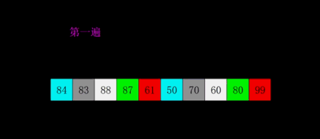

# [85] 希尔排序（Shell Sort）
也称递减增量排序算法，是插入排序的一种更高效的改进版本。按其设计者希尔（Donald Shell）的名字命名，该算法由1959年公布。希尔排序是非稳定排序算法。  
希尔排序是基于插入排序的以下两点性质而提出改进方法的：  
1. 插入排序在对几乎已经排好序的数据操作时，效率高，即可以达到线性排序的效率；
2. 但插入排序一般来说是低效的，因为插入排序每次只能将数据移动一位。



## 1. 算法思想
希尔排序：先追求表中元素部分有序，再逐渐逼近全局有序。

![[img/08_排序/png/10 希尔排序 1.png]]

对于插入排序而言，如果原本的表中元素基本有序的话，那采用直接插入排序会达到一个相应不错的效率。  

具体方法：先将待排序表分割成若干形如 $L[ i, i + d, i + 2d,…, i + kd ]$ 的“特殊”⼦表，对各个⼦表分别进⾏直接插⼊排序。缩⼩增量 $d$，重复上述过程，直到 $d = 1$ 为⽌。

## 2. 算法过程

![[img/08_排序/png/11 希尔排序 2.png]]
![[img/08_排序/png/12 希尔排序 3.png]]
![[img/08_排序/png/13 希尔排序 4.png]]

## 3. 算法实现
以`{'49','38','65','97','76','13','27','49'}`表排序为例。
```c
// 希尔排序
void shellSort(int A[],int n){
    // d是元素的增量，
    int d, i, j;
    // A[0]是暂存单元，不是哨兵，当j <= 0时,插入位置已到
    for(d = n/2; d >= 1; d = d/2){      // 控制步长
        for (i = d + 1; i <= n; ++i){
            if (A[i] <= A[i-d]){        // 需要将A[i]插入有序增量子表
                A[0] = A[i];            // 暂存在A[0]
                for(j= i-d;j>0&& A[0]<A[j]; j-=d){
                    A[j+d] = A[j];      // 记录后移
                }
                A[j+d] = A[0];          // 插入
            }
        }
    }
}
```

动画演示：
![[img/08_排序/png/14 希尔排序 代码实现1.png]]
![[img/08_排序/png/15 希尔排序 代码实现2.png]]
![[img/08_排序/png/16 希尔排序 代码实现3.png]]
![[img/08_排序/png/17 希尔排序 代码实现4.png]]
![[img/08_排序/png/18 希尔排序 代码实现5.png]]
![[img/08_排序/png/19 希尔排序 代码实现6.png]]
![[img/08_排序/png/20 希尔排序 代码实现7.png]]

![[img/08_排序/png/21 希尔排序 代码实现8.png]]
![[img/08_排序/png/22 希尔排序 代码实现9.png]]
![[img/08_排序/png/23 希尔排序 代码实现10.png]]

## 4. 算法性能分析
- 空间复杂度： $O(1)$
- 时间间复杂度：和增量序列 $d_1, d_2, d_3…$ 的选择有关，⽬前⽆法⽤数学⼿段证明确切的时间复杂度。
  - 最坏时间复杂度为 $O(N^2)$ ，当 $n$ 在某个范围内时，可达 $O(N^{1.3})$
- 稳定性：不稳定的排序算法
- 适⽤性：仅适⽤于顺序表，不适⽤于链表。

