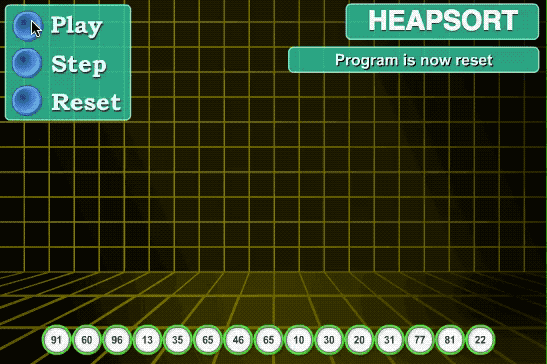

#数据结构 #算法 #C 
# [89] 堆排序
堆排序也属于选择排序
## 1. 堆（heap）
若 $n$个 关键字序列 $L[1…n]$ 满⾜下⾯某⼀条性质，则称为堆（Heap）：
1. 若满⾜：$L(i)≥L(2i)$ ，且 $L(i)≥L(2i+1)$ $(1 ≤ i ≤n/2 )$ —— 大根堆（大顶堆，Max heap）
2. 若满⾜：$L(i)≤L(2i)$ ，且 $L(i)≤L(2i+1) (1 ≤ i ≤n/2)$ —— 小根堆（小顶堆， Min heap）


## 2. 算法思想
思路：  
把所有非终端结点都检查⼀遍，是否满足“大根堆”的要求，如果不满足，则进⾏调整⼤根堆，若元素互换破坏了下⼀级的堆，则采⽤相同的⽅法继续往下调整（小元素不断“下坠”）。



## 3. 算法实现
```c
// 建立大根堆
void BuildMaxHeap(int array[], int len){
    // 从后往前调整所有非终端结点
    for (int i = len / 2; i > 0; i--){
        HeadAdjust(array, i, len);
    }
}

// 将以k为根的子树调整为大根堆
void HeadAdjust(int array[], int k, int len){
    // array[0] 暂存子树的根结点
    array[0] = array[k];
    // 沿key较大的子结点向下筛选
    for (int i = 2 * k; i < len; i *= 2){
        // 取key较大的子结点的下标
        if (i < len && array[i] < array[i + 1]) {
            i++;
        }
        // 筛选结束
        if (array[0] >= array[i]) {
            break;
        }
        // 将array[i] 调整到双亲结点上
        // 修改k值, 以便继续向下筛选
        else {
            array[k] = array[i];
            k = i;
        }
    }
    array[k] = array[0];
}

// 堆排序
void HeapSort(int array[], int len)
{
    BuildMaxHeap(array, len);
    for (int i=len; i >1; i--) {
        swap(array[i], array[1]);
        HeadAdjust(array, 1, i - 1);
    }
}
```
## 4. 算法性能

# [90]  堆的插入删除
对于小根堆，新元素放到表尾，与父结点对比，若新元素比父结点更小，则将二者互换。新元素就这样一路"上升"，直到无法继续上升为止。

被删除的元素用堆底元素替代，然后让该元素不断"下坠"，直到无法下坠为止。

