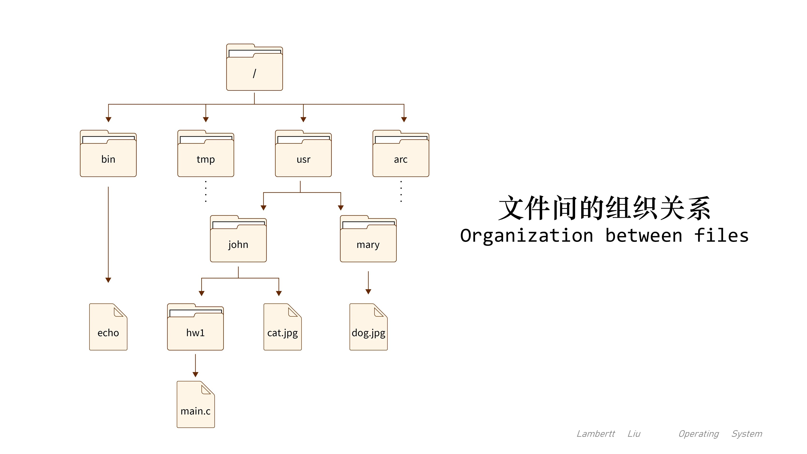

#操作系统 
# [50] 初识文件管理
文件, 就是一组有意义的信息/数据集合。

问题：
- 计算机中存放了各种各样的文件, 一个文件有哪些属性？ 
- **文件内部**的数据应该怎样组织起来？ 
- **文件之间**又应该又应该怎么组织起来？ 
站在操作系统的角度来看：
- 从下往上看, 操作系统应提供哪些功能, 才能方便用户、应用程序使用文件？ 
- 从上往下看, 文件数据应该怎么存放在外存(磁盘)上？

## 1.文件基本属性
- **文件名**：最基本的属性；由创建文件的用户决定文件名, 主要是为了方便用户找到文件, 同一目录下不允许有重名文件。
- **标识符**：一个系统内的各文件标识符唯一, 对用户来说毫无可读性, 因此标识符只是操作系统用于区分各个文件的一种内部名称。 
- **类型**：指明文件的类型。
- **位置**：文件存放的路径(让用户使用)、在外存中的地址(操作系统使用, 对用户不可见)。 
- **大小**：指明文件大小。
- **创建时间**、**上次修改时间**。
- **文件所有者信息**。 
- **保护信息**：对文件进行保护的访问控制信息。

## 2.内部的数据应该怎样组织起来
- 无结构文件(如文本文件), 由一些二进制或字符流组成, 又称“**流式文件**(stream)”
- 有结构文件(如数据库表), 由一条一条记录组成, 对于每一条记录, 由各相关数据项组成。

## 3.文件间的数据应该怎样组织起来
用户可以自己创建一层一层的目录, 各层目录中存放相应的文件。系统中的各个文件就通过一层一层的目录合理有序的组织起来了, 目录其实也是一种特殊的有结构文件(由记录组成)。所谓的“目录” 其实就是我们熟悉的“文件夹”。

## 4.操作系统应该向上提供哪些功能
- 创建文件(create 系统调用)
- 读文件(read 系统调用)
- 写文件(write 系统调用)
- 删除文件(delete 系统调用)
- 打开文件(open 系统调用)
- 关闭文件(close 系统调用)

可用几个基本操作完成更复杂的操作。  
比如：“复制文件”, 先创建一个新的空文件, 再把“源文件”读入内存, 再将内存中的数据写到新文件中。

## 5.从上往下看, 文件应如何存放在外存
操作系统以“块”为单位为文件分配存储空间, 因此即使一个文件大小只有10B, 但它依然需要占用 1KB 的磁盘块。外存中的数据读入内存时, 同样以块为单位。

类似于内存分为一个个“内存块”, 外存会分为一个个“块/磁盘块/物理块”。
每个磁盘块的大小是相等的, 每块一般包含2的整数幂个地址(如, 本例中, 一块包含2^10个地址, 即1KB)。同样类似的是, 文件的逻辑地址也可以分为(逻辑块号, 块内地址), 操作系统同样需要将逻辑地址转换为外存的物理地址(物理块号, 块内地址)的形式。块内地址的位数取决于磁盘块的大小。

文件数据放在离散的几个磁盘块中。此时, 应该如何记录各个磁盘块之间的先后顺序呢？这些需要后续的内容继续深入讨论。
# [51] 文件的逻辑结构

# [52] 文件目录

# [53] 文件保护

# [54] 文件共享

# [55] 文件实现(上)

# [56] 文件实现(下)

# [57] 逻辑结构V.S.物理结构

# [58] 文件存储空间管理

# [59] 文件的基本操作

# [60] 文件系统的层次结构